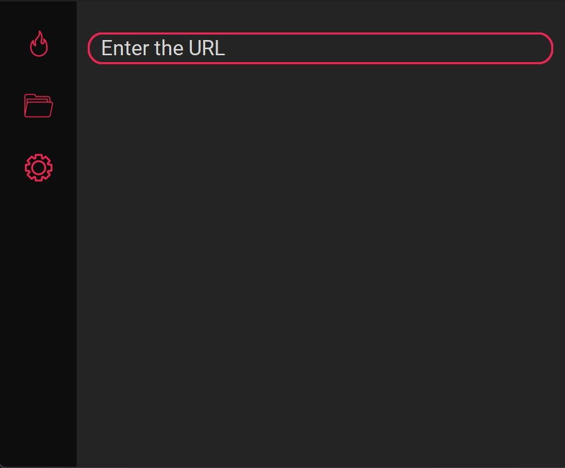
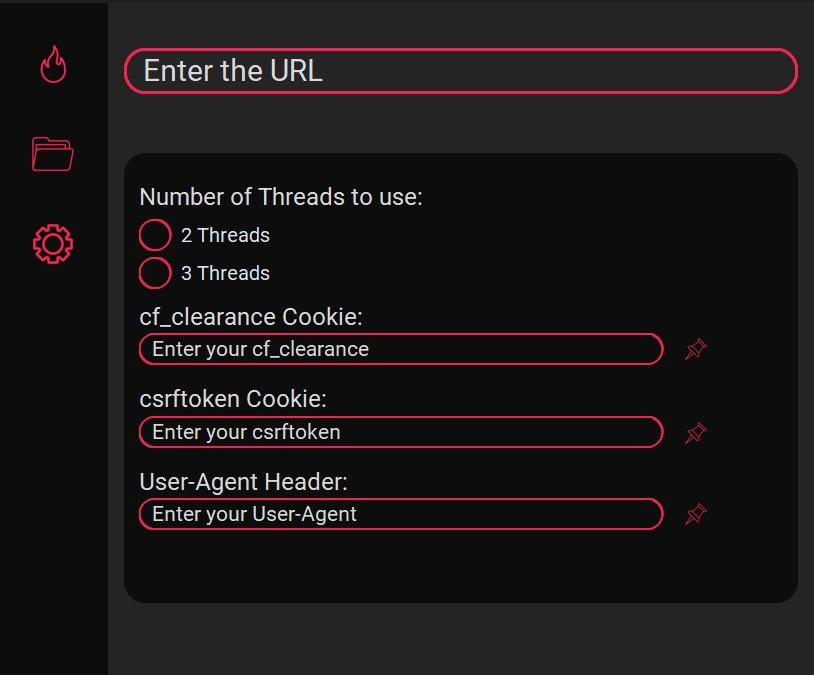

# HentaiScraper
Hentai scraper built with Python

A rough application for downloading nHentai doujinshi from nHentai to your local files without any account.

## Dependencies
- BeautifulSoup4
- Requests
- Pillow
- LXML
- Toml
- CustomtkInter

## Setting Up
Assuming you have downloaded the application already:

1. Getting your Credentials
    1. Go to [nHentai.net](https://nhentai.net)
    2. Open the Developer Tools
    3. Go to Storage and copy the cf_clearance and csrftoken values
    4. Go to [Whatismybrowser.com](https://www.whatismybrowser.com/detect/what-is-my-user-agent/) and copy your User-Agent

2. Loading your Credentials Through the App
    1. Open the application
    2. Click on the 'Settings' button
    3. Paste your cf_clearance, csrftoken, and User-Agent, respectively and click on the 'Pin' buttons

## What are Threads?
The number of threads will determine how many workers the application will use to speed up the network request process. May sometimes throw in error(not logged I'm too lazy) where the program will just stop. Just restart the application and boot up again, I think.

## Screenshots

What it looks like (pretty empty)

Settings Interface

Some guidde
